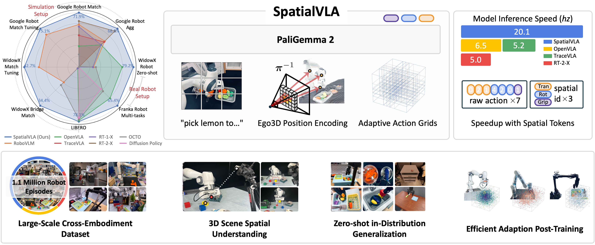
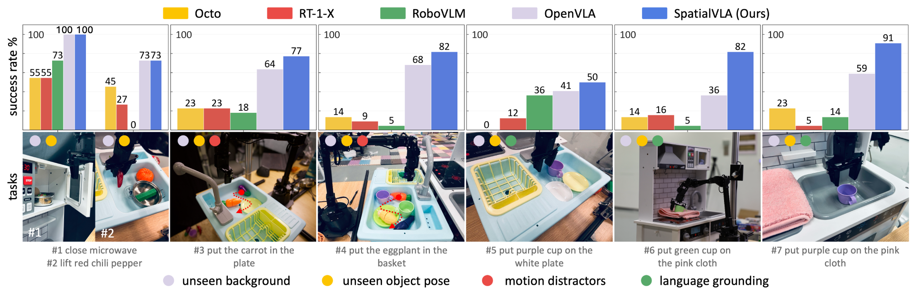
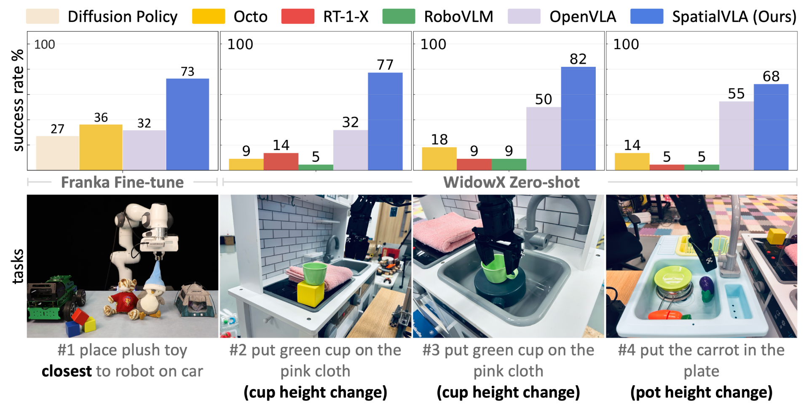
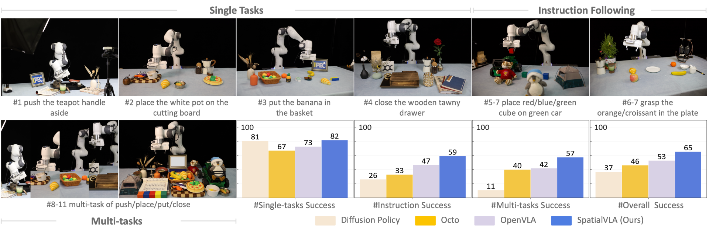

<div align="center">

# SpatialVLA: Exploring Spatial Representations for Visual-Language-Action Models (RSS 2025)
A spatial-enhanced vision-language-action model trained on 1.1 Million real robot episodes. 🤗
purely huggingFace-based, concise code with efficient performance.

> [Delin Qu*](https://github.com/DelinQu)<sup>1,2</sup>, [HaomingSong*](https://github.com/HaomingSong)<sup>1,3</sup>, [Qizhi Chen*](https://github.com/Tavish9)<sup>1,4</sup>, [Dong Wang†](https://scholar.google.com/citations?user=dasL9V4AAAAJ&hl=en)<sup>1</sup>, [Yuanqi Yao](https://scholar.google.com/citations?user=s482QHoAAAAJ&hl=zh-CN)<sup>1</sup>, [X. Ye](https://scholar.google.com/citations?user=GlYeyfoAAAAJ&hl=zh-CN)<sup>1</sup>, [Y. Ding](https://yding25.com)<sup>1</sup>, [Z. Wang](https://scholar.google.com/citations?user=cw3EaAYAAAAJ&hl=zh-CN)<sup>1</sup>, [Jiayuan Gu](https://cseweb.ucsd.edu/~jigu/)<sup>5</sup>, [Bin Zhao†](https://scholar.google.com/citations?hl=zh-CN&user=DQB0hqwAAAAJ)<sup>1</sup>, [Xuelong Li](https://scholar.google.com/citations?user=ahUibskAAAAJ)<sup>1,6</sup>
> Shanghai AI Laboratory<sup>1</sup>, Fudan University<sup>2</sup>, Shanghai Jiao Tong University<sup>3</sup>, Zhejiang University<sup>4</sup>, ShanghaiTech<sup>5</sup>, TeleAI<sup>6</sup>

[\[📄Paper\]](https://arxiv.org/pdf/2501.15830)  [\[🔥Project Page\]](https://spatialvla.github.io/) [\[📖 Document\]](#documents) [\[🚀 Quick Start\]](#-quick-start) [\[🤗 Model Zoo\]](https://huggingface.co/collections/IPEC-COMMUNITY/foundation-vision-language-action-model-6795eb96a9c661f90236acbb) [\[✅ Performance\]](#-performance-in-simulation-and-real-world) [\[🙋 FAQs\]](#-faqs)

[\[🔥Pre-train\]](#-pre-train-from-scratch) [\[🚀 Fine-tune\]](#-fine-tune-from-spatialvla) [\[🎄Custom Dataset\]](#-use-custom-datasets)



</div>

## News 🚀🚀🚀
- `2025/01/29`: We release the [SpatialVLA 1.0](https://huggingface.co/collections/IPEC-COMMUNITY/foundation-vision-language-action-model-6795eb96a9c661f90236acbb). SpatialVLA achieves state-of-the-art performance across a diverse range of evaluations and shows significantly faster inference speed with fewer tokens per action.
- `2025/02/06`: We release the SimplerEnv evaluation code for SpatialVLA. Please refer to [DelinQu/SimplerEnv-OpenVLA](https://github.com/DelinQu/SimplerEnv-OpenVLA/), and make sure `transformers >= 4.47.0`.
- `2025/03/16`: Simplify the code structure and fix the dependencies conflict in issue [#19](https://github.com/SpatialVLA/SpatialVLA/issues/19).

> [!NOTE]
> 🔥 **An advanced version of SpatialVLA is under development! It leverages [lerobot](https://github.com/huggingface/lerobot) to simplify and accelerate data loading, supports multi-view and state inputs, and features a more streamlined code structure with enhanced performance! Please check out the [lerobot-branch](https://github.com/SpatialVLA/SpatialVLA/tree/lerobot)**


## Documents

### 🚀 Quick Start

> [!TIP]
> During the runtime process, a large amount of data is cached in the CPU content. To better manage and allocate content, we have replaced the memory management tool library with `tcmalloc`.
> 
> For users with sudo privileges, you can install tcmalloc using `sudo apt-get install google-perftools` and find the `libtcmalloc.so.4` library in `/usr/lib/x86_64-linux-gnu` or `/usr/lib`.
> 
> For users without sudo privileges, you can download the suitable version for your operating system from [official repo](https://rpmfind.net/linux/rpm2html/search.php?query=libtcmalloc.so.4()(64bit)) and install it manually.
> 
> This step is **not** necessary and can be skipped based on your individual memory requirements.


SpatialVLA relies solely on HuggingFace Transformers 🤗, making deployment extremely easy. If your environment supports `transformers >= 4.47.0`, you can directly use the following code to load the model and perform inference. (requires 8.5GB of GPU memory).

```python
import torch
from PIL import Image
from transformers import AutoModel, AutoProcessor

model_name_or_path="IPEC-COMMUNITY/spatialvla-4b-224-pt"
processor = AutoProcessor.from_pretrained(model_name_or_path, trust_remote_code=True)
model = AutoModel.from_pretrained(model_name_or_path, trust_remote_code=True, torch_dtype=torch.bfloat16).eval().cuda()

image = Image.open("example.png").convert("RGB")
prompt = "What action should the robot take to pick the cup?"
inputs = processor(images=[image], text=prompt, return_tensors="pt")
generation_outputs = model.predict_action(inputs)

actions = processor.decode_actions(generation_outputs, unnorm_key="bridge_orig/1.0.0")
print(actions)
```

If you want to use the model for fine-tuning or pre-training, you need to install the required packages and download the model from the Hugging Face model hub. The VLM backbone of SpatialVLA is PaLiGemma2, which requires transformers >= 4.47.0. Hence, create a Python environment with Python >= 3.10.

```bash
git clone git@github.com:SpatialVLA/SpatialVLA.git --depth 1
conda create -n spatialvla python=3.10
conda activate spatialvla
```

Install packages from `requirements.txt` file. Note that we use a customised `dlimp` to support seed setting for reproducibility. If you catch any problems, please manually install the dlimp form the [dlimp_custom](https://github.com/SpatialVLA/dlimp_custom).

```bash
pip install -r requirements.txt
```

### 🌟 **Pre-train from Scratch**
SpatialVLA is pre-trained with 1.1 Million real-robot demonstrations from the OXE and RH20T dataset on a cluster of 64 A100 GPUs for abut 10 days, using a batch size of 2048. You can pre-train the model from scratch using the following command. Before running the script, please download the [Open X-Embodiment](https://robotics-transformer-x.github.io) dataset and [RH20T](https://rh20t.github.io/#download) dataset (optional). Please also filter the dataset by following the instructions in the [moojink/rlds_dataset_builder](https://github.com/moojink/rlds_dataset_builder) and [spatialvla/rh20t](https://github.com/SpatialVLA/rh20t) to filter the dataset or convert it to the RLDS format.

```bash
# download paligemma2 and zoe depth
bash scripts/hf_download.sh

# torchrun
bash scripts/spatialvla_4b_pretrain/torchrun_pretrain.sh

# or in a slurm cluster
bash scripts/spatialvla_4b_pretrain/slurm_pretrain.sh
```

### 🌟 **Fine-tune from SpatialVLA**

Most of our fine-tuning experiments are conducted using LoRA on 4 or 8 A100 GPUs. You can use the following scripts for full-parameter or LoRA fine-tuning. For real-world experiments with small datasets, we prefer using LoRA for fine-tuning.

```bash
# full fine-tuning
bash scripts/spatialvla_4b_finetune/finetune_full.sh

# LoRA fine-tuning
bash scripts/spatialvla_4b_finetune/finetune_lora.sh
```


### 🌟 **SimplerEnv Benchmark**
We release the SimplerEnv evaluation code for SpatialVLA based on [DelinQu/SimplerEnv-OpenVLA](https://github.com/DelinQu/SimplerEnv-OpenVLA/). Please install the simpler_env environment by following [DelinQu/SimplerEnv-OpenVLA](https://github.com/DelinQu/SimplerEnv-OpenVLA/) and make sure `transformers >= 4.47.0`. Please refer to the Please refer to the [Model Zoo](#-model-zoo) for the model and dataset settings. After install all the dependencies, you can perform the evaluation by: 

```bash
# under the project dir of SimplerEnv-OpenVLA/
bash scripts/run_spatialvla.sh
```
Note: Similar to most papers, e.g., HPT and TraceVLA, we omitted the `Open Top Drawer and Place Apple` from our evaluation, since the vast majority of policies achieved scores approaching 0 on this task.

### 🎄 Use Custom Datasets
To train on a custom dataset that is not part of OXE, we recommend converting it into the [RLDS](https://github.com/google-research/rlds) format, as this format directly aligns with our framework.

Once the dataset is converted, you’ll need to modify the following files:
- [data/oxe/mixtures.py](https://github.com/SpatialVLA/SpatialVLA/blob/main/data/oxe/mixtures.py): Define a new mixture for your dataset in the OXE_NAMED_MIXTURES dictionary.
- [data/oxe/configs.py](https://github.com/SpatialVLA/SpatialVLA/blob/main/data/oxe/configs.py): Add a new configuration specifying your dataset’s observation and action spaces to the OXE_DATASET_CONFIGS dictionary.
- [data/oxe/transforms.py](https://github.com/SpatialVLA/SpatialVLA/blob/main/data/oxe/transforms.py): Define a new dataset transform function for your dataset, and add it to the OXE_STANDARDIZATION_TRANSFORMS registry at the bottom of the file.

## 🤗 Model Zoo

<table>
  <tr>
    <th>Model Name</th>
    <th>Backbone</th>
    <th>VLA Model</th>
    <th>Note</th>
  </tr>
  <tr>
    <td>SpatialVLA-4B-224-pt</td>
    <td><a href="https://huggingface.co/google/paligemma2-3b-pt-224">google/paligemma2-3b-pt-224</a></td>
    <td><a href="https://huggingface.co/IPEC-COMMUNITY/spatialvla-4b-224-pt">spatialvla-4b-224-pt</a></td>
    <td>pretrained on openx and rh20t, TABLE I and II zero-shot, Fig.5 and 7</td>
  </tr>
  <tr>
    <td>SpatialVLA-4B-mix-224-pt</td>
    <td><a href="https://huggingface.co/IPEC-COMMUNITY/spatialvla-4b-224-pt">spatialvla-4b-224-pt</a></td>
    <td><a href="https://huggingface.co/IPEC-COMMUNITY/spatialvla-4b-mix-224-pt">spatialvla-4b-mix-224-pt</a></td>
    <td>fine-tuning on the fractal and bridge mixture dataset, Fig.5 and 7</a></td>
  </tr>
  <tr>
    <td>spatialvla-4b-224-sft-bridge</td>
    <td><a href="https://huggingface.co/IPEC-COMMUNITY/spatialvla-4b-224-pt">spatialvla-4b-224-pt</a></td>
    <td><a href="https://huggingface.co/IPEC-COMMUNITY/spatialvla-4b-224-sft-bridge">spatialvla-4b-224-sft-bridge</a></td>
    <td>fine-tuning on the bridge dataset, testing on simple-env widowx-robot, TABLE I fine-tuning</a></td>
  </tr>
  <tr>
    <td>spatialvla-4b-224-sft-bridge</td>
    <td><a href="https://huggingface.co/IPEC-COMMUNITY/spatialvla-4b-224-pt">spatialvla-4b-224-pt</a></td>
    <td><a href="https://huggingface.co/IPEC-COMMUNITY/spatialvla-4b-224-sft-fractal">spatialvla-4b-224-sft-fractal</a></td>
    <td>fine-tuning on the fractal dataset, testing on simple-env google-robot, TABLE II ine-tuning</a></td>
  </tr>
</table>

## ✅ Performance in Simulation and Real-world
> [!NOTE]
> SimplerEnv evaluation on Google Robot tasks.

<table border="1" class="dataframe">
  <thead>
    <tr style="text-align: center;">
      <th rowspan="2">Model</th>
      <th colspan="4">Visual Matching</th>
      <th colspan="4">Variant Aggregation</th>
    </tr>
    <tr style="text-align: center;">
      <th>Pick Coke Can</th>
      <th>Move Near</th>
      <th>Open/Close Drawer</th>
      <th>#Average</th>
      <th>Pick Coke Can</th>
      <th>Move Near</th>
      <th>Open/Close Drawer</th>
      <th>#Average</th>
    </tr>
  </thead>
  <tbody>
    <tr>
      <td>RT-1 (Begin)</td>
      <td>2.7%</td>
      <td>5.0%</td>
      <td>13.9%</td>
      <td>6.8%</td>
      <td>2.2%</td>
      <td>4.0%</td>
      <td>6.9%</td>
      <td>4.2%</td>
    </tr>
    <tr>
      <td>RT-1 (15%)</td>
      <td>71.0%</td>
      <td>35.4%</td>
      <td>56.5%</td>
      <td>60.2%</td>
      <td>81.3%</td>
      <td>44.6%</td>
      <td>26.7%</td>
      <td>56.2%</td>
    </tr>
    <tr>
      <td>RT-1 (Converged)</td>
      <td>85.7%</td>
      <td>44.2%</td>
      <td>73.0%</td>
      <td>74.6%</td>
      <td>89.8%</td>
      <td>50.0%</td>
      <td>32.3%</td>
      <td>63.3%</td>
    </tr>
    <tr>
      <td>HPT</td>
      <td>56.0%</td>
      <td>60.0%</td>
      <td>24.0%</td>
      <td>46.0%</td>
      <td>--</td>
      <td>--</td>
      <td>31.0%</td>
      <td>45.0%</td>
    </tr>
    <tr>
      <td>TraceVLA</td>
      <td>28.0%</td>
      <td>53.7%</td>
      <td>57.0%</td>
      <td>42.0%</td>
      <td>60.0%</td>
      <td>56.4%</td>
      <td>29.4%</td>
      <td>39.6%</td>
    </tr>
    <tr>
      <td>RT-1-X</td>
      <td>56.7%</td>
      <td>31.7%</td>
      <td>59.7%</td>
      <td>53.4%</td>
      <td>49.0%</td>
      <td>32.3%</td>
      <td>35.3%</td>
      <td>64.3%</td>
    </tr>
    <tr>
      <td>RT-2-X</td>
      <td>78.7%</td>
      <td>77.9%</td>
      <td>25.0%</td>
      <td>60.7%</td>
      <td>82.3%</td>
      <td>79.2%</td>
      <td>--</td>
      <td>--</td>
    </tr>
  <tr>
      <td>Octo-Base</td>
      <td>17.0%</td>
      <td>4.2%</td>
      <td>22.7%</td>
      <td>16.8%</td>
      <td>0.6%</td>
      <td>3.1%</td>
      <td>1.1%</td>
      <td>1.1%</td>
    </tr>
    <tr>
      <td>OpenVLA</td>
      <td>16.3%</td>
      <td>46.2%</td>
      <td>35.6%</td>
      <td>27.7%</td>
      <td>54.5%</td>
      <td>47.7%</td>
      <td>17.7%</td>
      <td>39.8%</td>
    </tr>
    <tr>
      <td>RoboVLM (zero-shot)</td>
      <td>72.7%</td>
      <td>66.3%</td>
      <td>26.8%</td>
      <td>56.3%</td>
      <td>68.3%</td>
      <td>56.0%</td>
      <td>8.5%</td>
      <td>46.3%</td>
    </tr>
    <tr>
      <td>RoboVLM (fine-tuning)</td>
      <td>77.3%</td>
      <td>61.7%</td>
      <td>43.5%</td>
      <td>63.4%</td>
      <td>75.6%</td>
      <td>60.0%</td>
      <td>10.6%</td>
      <td>51.3%</td>
    </tr>
    <tr>
      <td>SpatialVLA (zero-shot)</td>
      <td><b>81.0%</b></td>
      <td><b>69.6%</b></td>
      <td><b>59.3%</b></td>
      <td><b>71.9%</b></td>
      <td><b>89.5%</b></td>
      <td><b>71.7%</b></td>
      <td>36.2%</td>
      <td><b>68.8%</b></td>
    </tr>
    <tr>
      <td>SpatialVLA (fine-tuning)</td>
      <td><b>86.0%</b></td>
      <td><b>77.9%</b></td>
      <td>57.4%</td>
      <td><b>75.1%</b></td>
      <td>88.0%</td>
      <td>72.7%</td>
      <td>41.8%</td>
      <td><b>70.7%</b></td>
    </tr>
  </tbody>
</table>

> [!NOTE]
> SimplerEnv evaluation on WidowX Robot tasks.

  <table border="1" class="dataframe">
    <thead>
      <tr style="text-align: center;">
        <th rowspan="2">Model</th>
        <th colspan="2">Put Spoon on Towel</th>
        <th colspan="2">Put Carrot on Plate</th>
        <th colspan="2">Stack Green Block on Yellow Block</th>
        <th colspan="2">Put Eggplant in Yellow Basket</th>
        <th rowspan="2">#Overall Average</th>
      </tr>
      <tr style="text-align: center;">
        <th>Grasp Spoon</th>
        <th>Success</th>
        <th>Grasp Carrot</th>
        <th>Success</th>
        <th>Grasp Green Block</th>
        <th>Success</th>
        <th>Grasp Eggplant</th>
        <th>Success</th>
      </tr>
    </thead>
    <tbody>
      <tr>
        <td>RT-1-X</td>
        <td>16.7%</td>
        <td>0.0%</td>
        <td>20.8%</td>
        <td>4.2%</td>
        <td>8.3%</td>
        <td>0.0%</td>
        <td>0.0%</td>
        <td>0.0%</td>
        <td>1.1%</td>
      </tr>
      <tr>
        <td>Octo-Base</td>
        <td>34.7%</td>
        <td>12.5%</td>
        <td>52.8%</td>
        <td>8.3%</td>
        <td>31.9%</td>
        <td>0.0%</td>
        <td>66.7%</td>
        <td>43.1%</td>
        <td>16.0%</td>
      </tr>
      <tr>
        <td>Octo-Small</td>
        <td>77.8%</td>
        <td>47.2%</td>
        <td>27.8%</td>
        <td>9.7%</td>
        <td>40.3%</td>
        <td>4.2%</td>
        <td>87.5%</td>
        <td>56.9%</td>
        <td>30.0%</td>
      </tr>
      <tr>
        <td>OpenVLA</td>
        <td>4.1%</td>
        <td>0.0%</td>
        <td>33.3%</td>
        <td>0.0%</td>
        <td>12.5%</td>
        <td>0.0%</td>
        <td>8.3%</td>
        <td>4.1%</td>
        <td>1.0%</td>
      </tr>
      <tr>
        <td>RoboVLM (zero-shot)</td>
        <td>37.5%</td>
        <td>20.8%</td>
        <td>33.3%</td>
        <td>25.0%</td>
        <td>8.3%</td>
        <td>8.3%</td>
        <td>0.0%</td>
        <td>0.0%</td>
        <td>13.5%</td>
      </tr>
      <tr>
        <td>RoboVLM (fine-tuning)</td>
        <td>54.2%</td>
        <td>29.2%</td>
        <td>25.0%</td>
        <td>25.0%</td>
        <td>45.8%</td>
        <td>12.5%</td>
        <td>58.3%</td>
        <td>58.3%</td>
        <td>31.3%</td>
      </tr>
      <tr>
        <td>SpatialVLA (zero-shot)</td>
        <td><b>25.0%</b></td>
        <td><b>20.8%</b></td>
        <td><b>41.7%</b></td>
        <td>20.8%</td>
        <td><b>58.3%</b></td>
        <td>25.0%</td>
        <td><b>79.2%</b></td>
        <td>70.8%</td>
        <td><b>34.4%</b></td>
      </tr>
      <tr>
        <td>SpatialVLA (fine-tuning)</td>
        <td><b>20.8%</b></td>
        <td>16.7%</td>
        <td>29.2%</td>
        <td>25.0%</td>
        <td><b>62.5%</b></td>
        <td>29.2%</td>
        <td><b>100.0%</b></td>
        <td><b>100.0%</b></td>
        <td><b>42.7%</b></td>
      </tr>
    </tbody>
  </table>

> [!NOTE]
> LIBERO Simulation Benchmark Results.

<table border="1" class="dataframe">
  <thead>
    <tr style="text-align: center;">
      <th rowspan="2">Model</th>
      <th colspan="2">LIBERO-Spatial</th>
      <th colspan="2">LIBERO-Object</th>
      <th colspan="2">LIBERO-Goal</th>
      <th colspan="2">LIBERO-Long</th>
      <th colspan="2">Average</th>
    </tr>
    <tr style="text-align: center;">
      <th>SR (↑)</th>
      <th>Rank (↓)</th>
      <th>SR (↑)</th>
      <th>Rank (↓)</th>
      <th>SR (↑)</th>
      <th>Rank (↓)</th>
      <th>SR (↑)</th>
      <th>Rank (↓)</th>
      <th>SR (↑)</th>
      <th>Rank (↓)</th>
    </tr>
  </thead>
  <tbody>
    <tr>
      <td>Diffusion Policy from scratch</td>
      <td>78.3 ± 1.1%</td>
      <td>5</td>
      <td><b>92.5 ± 0.7%</b></td>
      <td>1</td>
      <td>68.3 ± 1.2%</td>
      <td>5</td>
      <td>50.5 ± 1.3%</td>
      <td>5</td>
      <td>72.4 ± 0.7%</td>
      <td>5</td>
    </tr>
    <tr>
      <td>Octo fine-tuned</td>
      <td>78.9 ± 1.0%</td>
      <td>4</td>
      <td>85.7 ± 0.9%</td>
      <td>4</td>
      <td><b>84.6 ± 0.9%</b></td>
      <td>1</td>
      <td>51.1 ± 1.3%</td>
      <td>4</td>
      <td>75.1 ± 0.6%</td>
      <td>3</td>
    </tr>
    <tr>
      <td>OpenVLA fine-tuned</td>
      <td>84.7 ± 0.9%</td>
      <td>2</td>
      <td>88.4 ± 0.8%</td>
      <td>3</td>
      <td>79.2 ± 1.0%</td>
      <td>2</td>
      <td>53.7 ± 1.3%</td>
      <td>3</td>
      <td>76.5 ± 0.6%</td>
      <td>2</td>
    </tr>
    <tr>
      <td>TraceVLA fine-tuned</td>
      <td>84.6 ± 0.2%</td>
      <td>3</td>
      <td>85.2 ± 0.4%</td>
      <td>5</td>
      <td>75.1 ± 0.3%</td>
      <td>4</td>
      <td>54.1 ± 1.0%</td>
      <td>2</td>
      <td>74.8 ± 0.5%</td>
      <td>4</td>
    </tr>
    <tr>
      <td>SpatialVLA fine-tuned</td>
      <td><b>88.2 ± 0.5%</b></td>
      <td>1</td>
      <td>89.9 ± 0.7%</td>
      <td>2</td>
      <td>78.6 ± 0.6%</td>
      <td>3</td>
      <td><b>55.5 ± 1.0%</b></td>
      <td>1</td>
      <td><b>78.1 ± 0.7%</b></td>
      <td>1</td>
    </tr>
  </tbody>
</table>

> [!NOTE]
> Zero-shot Robot Control Evaluation on real-world WidowX Robot.



> [!NOTE]
> Spatial Understanding Capability Evaluation.



> [!NOTE]
> Adapting to New Robot Setups on Franka Robot.



## TODO List

- [x] Release pre-training / fine-tuning code for SpatialVLA series.
- [x] Release the code, model, and custom data of SpatialVLA.
- [x] Release the SimplerENV evaluation code for SpatialVLA series
- [ ] Release SpatialVLA2

## 🤗 FAQs
If you encounter any issues, feel free to open an issue on GitHub or reach out through discussions. We appreciate your feedback and contributions! 🚀

## License

This project is released under the [MIT license](LICENSE). Parts of this project contain code and models from other sources, which are subject to their respective licenses.

## Citation

If you find this project useful in your research, please consider cite:

```BibTeX
@article{qu2025spatialvla,
  title={SpatialVLA: Exploring Spatial Representations for Visual-Language-Action Model},
  author={Qu, Delin and Song, Haoming and Chen, Qizhi and Yao, Yuanqi and Ye, Xinyi and Ding, Yan and Wang, Zhigang and Gu, JiaYuan and Zhao, Bin and Wang, Dong and others},
  journal={arXiv preprint arXiv:2501.15830},
  year={2025}
}
```

## Acknowledgement
SpatialVLA is built with reference to the code of the following projects: [InternVL](https://github.com/OpenGVLab/InternVL), [Google Paligemma2](https://huggingface.co/google/paligemma2-3b-pt-224), [Transformers](https://github.com/huggingface/transformers), [OpenVLA](https://github.com/openvla/openvla) and [ZoeDepth](https://huggingface.co/spaces/shariqfarooq/ZoeDepth). Thanks for their awesome work!
